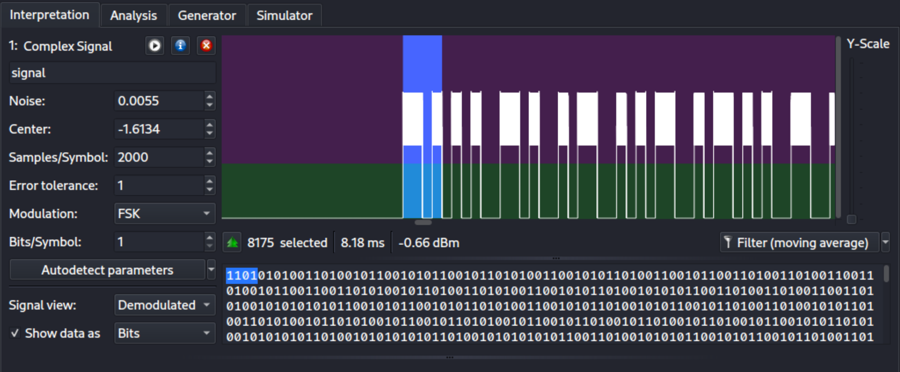

The file is in `.complex16s` format and a search online indicates we need [Universal Radio Hacker](https://github.com/jopohl/urh) to open it. First look at the Analog signal. It seems that the waves have no amplitude change for [ASK](https://en.wikipedia.org/wiki/Amplitude-shift_keying), no frequency change for [FSK](https://en.wikipedia.org/wiki/Frequency-shift_keying), nor phase shift for [PSK](https://en.wikipedia.org/wiki/Phase-shift_keying). The spacing between signal vs no-signal seems to be evenly divided, so we guess the modulation is using [OOK](https://en.wikipedia.org/wiki/On%E2%80%93off_keying). We can regard it as a special form of FSK, with $0$ frequency when there is no signal. 

Then using the settings in the following picture, we are able to extract a sequence of bits. 

As the challenge describes the transmission using some [line code](https://en.wikipedia.org/wiki/Line_code), we first exclude all RZ/NRZ codes because we have at most $2$ consecutive `0` or `1`. Then it remains to try out all biphase codes. First try Manchester code, but our code starts with `11`, which suggests there must be a `0` at the beginning. Examining the length of the binary string, we add another `0` at the end of the string. Decode and the flag emerges. I was lucky to try Manchester first. 