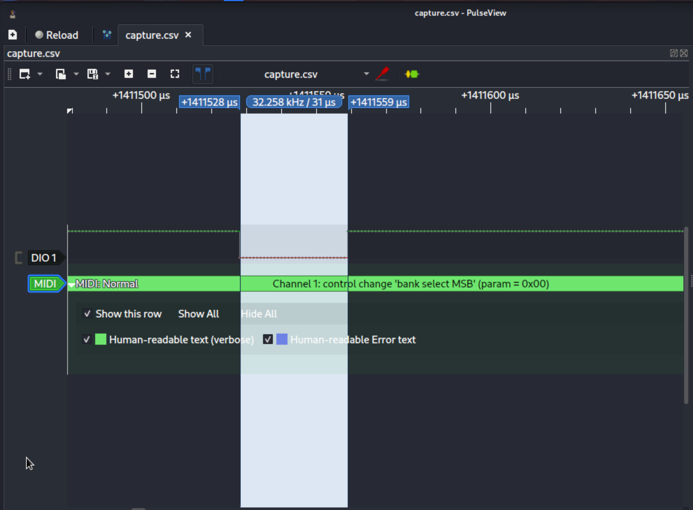

From the website, my first guess was something related to `MIDI`. Looking at the csv, we can find both a clock channel and a data channel. I have worked with [Async Serial Analyzer on Saleae](https://support.saleae.com/protocol-analyzers/analyzer-user-guides/using-async-serial) but when I tried to import the `.csv` file to Saleae, I couldn't. A search online indicates that [we need to use PulseView instead](https://support.saleae.com/faq/technical-faq/is-it-possible-to-import-data-into-the-logic-software). Then install [PulseView](https://sigrok.org/wiki/PulseView). 

Use `pulseview` then `Import Comma-separated values`, and write `t,b1` as column format when importing, meaning the first column is the timestamp and the second column is a 1-bit data. 

Then `Add Protocol Decoder` and add a `MIDI` decoder on top of `uart`. Then we click the `MIDI` channel, and set `RX` to channel `DIO1` and we need to determine the [Baud rate](https://en.wikipedia.org/wiki/Baud) of the signal. 

To find the Baud rate, first find the smallest interval and then measure the interval using the cursors. In the image, it shows that we have a Baud rate of 32258. 

After setting the correct Baud rate in the `MIDI` channel, extract the data. We are able to find a sequence of notes played on the keyboard. If we play the same [tune](https://www.youtube.com/watch?v=wDgQdr8ZkTw) on the challenge website again, we get the flag. 
