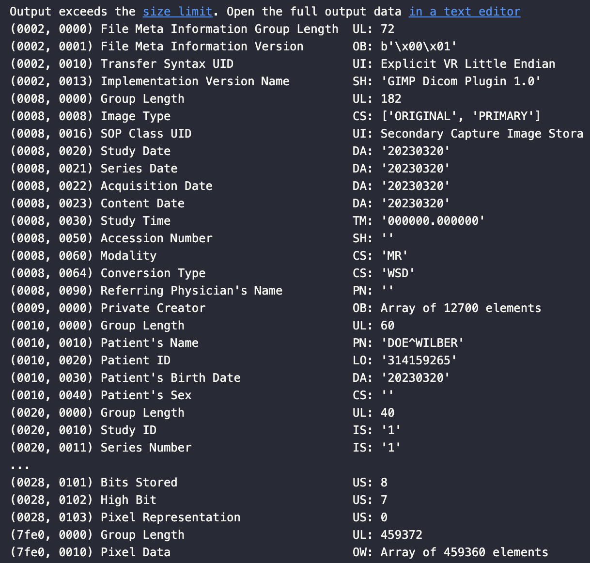

The challenge has a file that seems to be a matryoshka doll. Running `file stage_1.whatami` will tell us that the file is a JPEG image. Open it using any image editor will reveal the `A` part of the flag. 

Then we use `binwalk --dd='.*' stage_1.whatami` and try to extract the files in the image file. However, the `.pdf` and `.zip` files being obtained are corrupted. This indicates that we need to take a look at the file ourselves using a hex editor. 

A search online shows that JPEG has ending signal `FF D9` and we can find it at offset `0x1904`. After this offset, we pay attention to the printable text of the binary data and realize that at offset `0x8001` there is text like `CD001`. Using [List of file signatures](https://en.wikipedia.org/wiki/List_of_file_signatures) we realize they are `.iso` images. Change the file name to `stage_1.iso` and we can extract two files `stage_2.whatami` and `stage_3.whatami`. 

First realize that `stage_3.whatami` is a `.zip` archive and after unarchiving it, we obtain a `stage_3` file which is a `.pdf` file containing the `D` part of the flag. There is also a `fragment_e` file, which seems to be a C source code for decoding some obfuscated string. Honestly I did not even read the `magic` function because when I saw two long hex strings of the same length under `magic`, my crypto instinct urged me to XOR these two strings and it becomes clear that we need to use the compiled file to decode the random string. Then the `E` part of the flag is simply here. 

In the end we have to deal with the difficult `stage_2.whatami` file. From the `DICM` signature we know it's a `.dicom` file for aggregating medical data. I tried multiple third party softwares and websites to open the file, all failed. I then used a hex editor to look into the file and could figure out that it contained an `.mp4` video but it was also corrupted. In the end I found the `pydicom` library for handling and parsing `.dicom` files and it worked well. A list of content looks like


Then we extract the pixel data from the file and reassembly them into a valid picture containing `C` part of the flag. 
```python
from pydicom import dcmread
import matplotlib.pyplot as plt

ds = dcmread('./stage_2.whatami')
pixel = ds.PixelData
rows = [pixel[3*480*i: 3*480*(i+1)] for i in range(319)]
cols = [[list(i[3*j:3*(j+1)]) for j in range(480)] for i in rows]
plt.imshow(cols)
```

Finally it comes to the hardest part. The corrupted `.mp4` file is a real pain to deal with! I bashed my head against the wall for 12 hours straight! I thought initially that it were a problem with the `H.264` encoding and I even read multiple sections of [the f manual for `H.264`](https://www.itu.int/rec/T-REC-H.264). It did not fix anything. I tried to extract the raw `H.264` frame and view it but failed. I also tracked all the length header for each section of the `.mp4` data and still nothing incorrect. In the end I watched the video [What's in the box?!](https://www.youtube.com/watch?v=iJAPTY3B7yE) and tried to track piece by piece of the header and finally realized that the `stco` box has a wrong offset of `03 EE` pointing to some random text about `H.264` encoding parameters, instead of the start of `mdat` at offset `03 5E`. Fixing the wrong byte instantly gives us a working `.mp4` file. It remains to use `ffmpeg` to extract the frame and read the `B` part of the flag. 

Take away: 
* Do not use cheesy useless third party tools for your `.dicom` file. 
* Avoid reading documentation for `H.264` at all cost. 