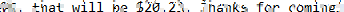

All we get is some pixelated text. When I look really hard into the picture I can somehow identify "Problem 1 would like the Coke" and "Problem 1 will pay for his ????" in the main text body. The opening part of the text looks like a menu because I can identify something like "Ice Cream", "Coke", and "Whipped Cream". 

I first searched some online "AI-powered" tools for depixelation, but none of them worked properly for text. Then I found out a [writeup](https://bishopfox.com/blog/unredacter-tool-never-pixelation) and its tool [Unredacter](https://github.com/bishopfox/unredacter). However, for some reason this does not even work for the sample image provided by the author. The content of the writeup points us to [Depix](https://github.com/beurtschipper/Depix) which actually works. 

Following the workflow for Depix, we first create a text file containing the [de Bruijn sequence](https://en.wikipedia.org/wiki/De_Bruijn_sequence) of all possible characters in the text. Based on a crude reading previously, there are not many capital letters. Thus the total character set for our sequence is `PCWabcdefghijklmnopqrstu0123456789$ vwxyz`. (My first character set actually did not contain `$` but I realized it occurred a lot of times in the text. Including it would significantly improve the quality of depixelation.) To generate the sequence, use the python script provided on the Wikipedia website. Then we paste the text into a Windows Notepad, make sure the fonts are of the same size, and take a screenshot. 


Then we crop a single line of pixelated text, for example the last line


Run Depix with `depix -p in.png -s debruijn.png -o out.png` and get



Although the recovered text is not ideal, we can still roughly read `PS, that will be $20.23, thanks for coming! `

Using exactly the same way, we can figure out that the menu above is actually a list of prices (and the "Coke" I guessed is actually "Cake", "Problem 1" is actually "Person 1"). With some guessing, the beginning is roughly something like
```
Hi, welcome to SecChallenge 2023, here is a menu

Nice Crispy Treat: $10
Ice Cream: $20
Cookies: $40
Cake: $80

Here are your sides

Whipped Cream: $1
Chocolate: $2
Caramel: $3
Sugar Topping: $4
Gold Foil: $5

May I take your order?
```
and then, each person would ask for something to eat. Our task is to calculate how much are they going to pay. The total prices for the first four customers will be $99, $100, $50, $51, and so on. Decoding them gives a flag `cd23` and so on. 

Note:
1. Depix can only take one line at a time, but there is no need to crop every single line in the text body. The trick is to recognize the length of each dish and the outline of the sentences (so only Depix once for each type of sentences). Soon your brain will be able to automatically depixelate for you (your eyes will hurt though). 
2. Both addition and subtraction happen in their orders. Make sure to depixelate every time whenever a new sentence outline shows up. 
3. Make sure to crop at a pixel-by-pixel level accuracy. If the depixelation is unsuccessful, try to adjust the height by either including more or less pixels. I used [GIMP](https://www.gimp.org/) for cropping. 
4. If a sentence still cannot be depixelated, try to design a new character set and generate new de Bruijn sequence for the sentence alone. However, I personally believe the above picture is enough for this challenge, with a bit of luck and guessing perhaps. 
