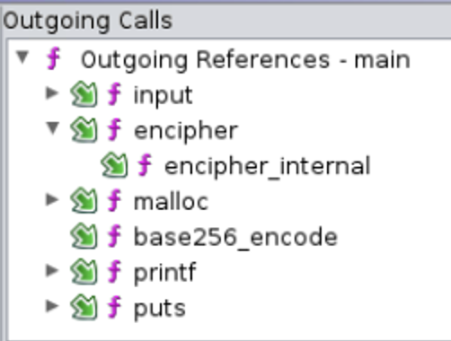

This is the hardest one among all challenges I solved in the CTF. We are given a binary and a few lines of emoji to decrypt. 

First play with the binary. Just a few trials would tell us that the binary is a block cipher running in ECB mode with 8-byte block size. Because if we input 7 printable letters (with the eighth being new line `\n` or `0x0a`), it always returns 8 random emoji plus the rest being a recurring pattern 🐱🚛🐀🚞🚴🐤👑🍋. If we increase our input to 9 letters, the first 16 emoji will appear random and the rest is still maintaining the recurring pattern 🐱🚛🐀🚞🚴🐤👑🍋.

Now it's time to look at the source code. Running `file` on the binary indicates that debug symbols are not stripped, a good start! Load the binary in Ghidra and realize it's heavily obfuscated with a lot of garbage code. However, the function call tree is quite simple and helpful.



It tells us the skeleton of the program: a block cipher that takes input with `input`, and encrypts in ECB mode with `encipher`. The `encipher_internal` could be an S-box (or something similar) that awaits reversing. The result will then be encoded with `base256_encode` into emoji, and finally printed to the screen. 

We would first identify the `base256_encode` function. A search online shows two different emoji encoding schemes: [`base256`](https://github.com/Equim-chan/base256) and [`emoji256`](https://github.com/andrew-d/emoji256). While some ciphertext contains emojis that are not in the alphabet of the latter, we have more faith in the former encoding. Load GDB and set a breakpoint at calling `base256_encode`. We figure out that the parameters passed into the function are `(*output, output_length, *input, input_length)`. Simply comparing the input with the printed emojis, we conclude that the implementation for emoji encoding is the same as [`base256`](https://github.com/Equim-chan/base256). Now we can decode the emojis into bytes in the challenge description. However, to read it we need to reverse the encryption algorithm. 

As we already know the program is most probably a block cipher running in ECB, we need to determine the proportion of components implemented in `encipher` vs `encipher_internal`. First set breakpoint at these two functions and count the number of function calls. It shows a pattern of 1 `encipher` call followed by 64 `encipher_internal` calls. Moreover we call 8 times `encipher` during the execution of the whole program. `encipher` only has two arguments and it seems to be `(key, *input)`, where `*input` is the next 8-byte block of our input. Now we know that `encipher` is the encryption algorithm for a single block, where each block is processed with `encipher_internal` for 64 rounds. 

Then it comes to the painful part. There is no (at least I don't know) shortcut for reversing `encipher_internal`. We always use input `01234567` so our first block is consistent during our test and is easily identified in hex. Looking at the stack each time we hit breakpoint for `encipher_internal`, we realize that there are three addresses being updated each round like internal states, and are of special interest: `rsp+0x30, rsp+0x40, rsp+0x50`. In particular, our 8-byte block input is broken into two 4-byte parts. `rsp+0x40` is initialized to the right part `4567`, and `rsp+0x50` is initialized to the left part `0123`. This gives us a hint of [Feistel network](https://en.wikipedia.org/wiki/Feistel_cipher). `rsp+0x30` is initialized to all zero and later figured out to be the round key. We set watchpoints on these 3 addresses for both reading and writing, and try to figure out what is happening each time they are hit. Moreover, we use the [record and replay](https://sourceware.org/gdb/onlinedocs/gdb/Process-Record-and-Replay.html) feature of GDB so we can go backwards with [reverse execution](https://sourceware.org/gdb/onlinedocs/gdb/Reverse-Execution.html). It is very helpful to go back instruction-by-instruction with `reverse-nexti`. 

The good news is, garbage code does not access these three watchpointed addresses (otherwise it would be exponentially more painful). Moreover, garbage code always comes with a bulky blob of exotic instructions on exotic constants so it's easy to distinguish them from real code. 

There is no trick left, just execute forwards/backwards, read the assembly code, and try to recover one round of `encipher_internal`. Once done, extract the round keys by setting commands each time we hit a breakpoint of `encipher_internal`. The [`ignore`](https://sourceware.org/gdb/onlinedocs/gdb/Conditions.html) command of GDB can be helpful as well. The good news is, the round keys and the lookup table `P` are fixed and does not depend on some other internal state (otherwise we also have to reverse the key scheduling). Moreover, running in ECB uses the same settings for all blocks has made our life easier. 

Note: 
1. I use `v2` for `rsp+0x50`, `v3` for `rsp+0x40`, and `v4` for `rsp+0x30`. 
2. My variable naming can be confusing: `ecx`, `edx`, `eax` are just variable names, not necessarily the same registers when reversing. 
3. Mind the endianness. 
4. One of the `offset` is left as an exercise to the reader. 

```python
# converting memory block to 32-bit integer
def x2int(a):
    l = [a[i:i+2] for i in range(0, len(a), 2)]
    l = l[::-1]
    return int("".join(l),16)

# inverse of x2int
def int2x(a):  
    a = hex(a)[2:].zfill(8)
    l = [a[i:i+2] for i in range(0, len(a), 2)]
    l = l[::-1]
    return "".join(l)

# lookup table and round keys
P = ['1a3f9c32','e55f4373','197dea64','34e9ad8e']
P = [x2int(i) for i in P]
key = '00000000aaface1854f59d31feef6c4aa8ea3b6352e50a7cfcdfd994a6daa8ad50d577c6facf46dfa4ca15f84ec5e410f8bfb329a2ba82424cb5515bf6af2074a0aaef8c4aa5bea5f49f8dbe9e9a5cd748952bf0f28ffa089c8ac9214685983af07f67539a7a366c44750585ee6fd49d986aa3b6426572cfec5f41e8965a10014055df19ea4fae32944a7d4b3e454c64e83f1b7d923aea953c35b9aee62f88c7902a57e03a2526f9e41ff5118e1ac42a38159343e20f625c8c0a31753605008ee0ffcea68afa9dbf34f56cd8deef3bf188ea0a0a32e5d922dcdfa83b86da775430d5466ddacf158684cae49e2ec5b3b7d8bf82d082ba51e92cb52002d6afef1a80aabe33'
round_key = [key[i:i+8] for i in range(0, len(key), 8)]
round_key = [x2int(i) for i in round_key]

# encrypt a block
def enc(v):
    # v = "3031323334353637" for testing
    v2 = x2int(v[:8])
    v3 = x2int(v[8:])
    for i in range(64):
        v4 = round_key[i]
        ecx = (v3 << 4) % 2**32
        edx = (v3 >> 5)
        ecx = ecx ^ edx
        ecx = (ecx + v3) % 2**32
        offset = v4 & 3
        eax = (v4 + P[offset]) % 2**32
        ecx = ecx ^ eax
        v2 = (ecx + v2) % 2**32
        
        v4 = round_key[i+1]    
        ecx = (v2 << 4) % 2**32
        edx = (v2 >> 5)
        ecx = ecx ^ edx
        ecx = (ecx + v2) % 2**32
        offset = ???
        eax = (v4 + P[offset]) % 2**32
        ecx = ecx ^ eax
        v3 = (ecx + v3) % 2**32
    return int2x(v2) + int2x(v3)

# decrypt a block
def dec(v):
    v2 = x2int(v[:8])
    v3 = x2int(v[8:])
    for i in range(64):
        v4 = round_key[64-i]
        ecx = (v2 << 4) % 2**32
        edx = (v2 >> 5)
        ecx = ecx ^ edx
        ecx = (ecx + v2) % 2**32
        offset = ???
        eax = (v4 + P[offset]) % 2**32
        ecx = ecx ^ eax
        v3 = (v3 - ecx) % 2**32

        v4 = round_key[64-i-1]
        ecx = (v3 << 4) % 2**32
        edx = (v3 >> 5)
        ecx = ecx ^ edx
        ecx = (ecx + v3) % 2**32
        offset = v4 & 3
        eax = (v4 + P[offset]) % 2**32
        ecx = ecx ^ eax
        v2 = (v2 - ecx) % 2**32
    return int2x(v2) + int2x(v3)
```
